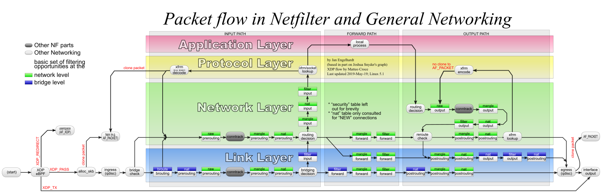

# How Linux Routes Packets

This post covers the technical details of packet routing in Linux. Linux
has mechanisms in place to route packets using basic, "destination" based routing,
and advanced or policy-based routing. Part of the motivation for this deepdive
was the observation and subsequently exploited vulnerability by one of
my buddies, William Tolley. He found that when a VPN is running on Android,
an attacker can spoof packets to the tun interface that match an existing 
connection and that the Android device, more specifically, the process
with the connection, will respond. This went on to become known as the
blind in/on-path attack, this one being the socalled client-side attack.

Part of the reason this is concerning is because in theory, the Android device
should not respond to such packets. Why is that? Because the tun interface
is isolated from the outside world in theory. The fact that it responds
is a clear violation of non-interference and demonstrates that something
is going on that prevents the network stack from properly enforcing
process isolation. Process isolation is a fundamental OS security concept
and when it is violated, bad things tend to happen. Their assessment 
of the issue was that because mobile devices have multiple interfaces, are constantly moving around,
pinging various cell towers, and receiving new IP addresses, it is not possible
to truly enforce the "strong-host" model, though the Android networking
team has made attempts to use various Linux constructs, such as 
multiple routing tables, network name spaces, Netfilter rules, 
and firewall marks (`fwmark`), to simulate the strong-host model. 
What this means at the end of the day is that Android uses policy based routing
to make the VPN service work without completely ruining the user experience.

For details about how the socket is initially created, read my post, [Sockets in the Linux Kernel](https://bmixonba.github.io/2025-05-22-Sockets-in-the-Linux-Kernel/)

# The Attack

The client-side attack works as follows. Assume that a target, `T`, is
connected to a VPN server, `V`, and has an ESTABLISHED TCP connection to a
website, `W`. `T` sends data to `W` by issuing `write`s (`send` or `sendmsg`)
to a socket, `_s_`. In Android the socket writes an `fwmark` from the socket to
the `skb` to be sent. As the `skb` travels down the network stack from `send`
to `ip_send` (or whatever its called), the kernel uses the `fwmark` to set the
`skb->dev` of the outgoing packet so that it can be written to the `tun` device
that represents the link-layer connection between `T` and `V`.  The VPN client
process on `T` intercepts this packet, encrypts the packet from layer 3 (IP)
and above, encasulates this packet by appending out layer 3 and 4 headers to
the packet, and sending it down to the link-layer driver for the wireless or
mobile model (`wlan0` or `rmnet1` in my case) to be transmitted to the next
hop, an eventually to `V`. 

The attacker can determine whether such a `T-W` connection exists in the
following way.  First, the attacker spoofs a packet `p` from `W` to the `T`. The
packet's structure is as follows. The link-layer header has a destination MAC
address that matches `wlan0`'s MAC address. The network layer header has a
source IP address equal to `W`'s public IP and a destination IP equal to
`tun0`'s private IP address. The transport layer header has a source port equal
to `W`'s listening port, and a destination port equal to the socket's port on
`W`. Additionally, the TCP seq and ack numbers need to be "in-window". finally,
the TCP flag should be set to `RST`. When this happens, the `T` will respond
with a challenge-ACK. The challenge ACK will.

This is bad for a number of reasons that are covered in William's USENIX Security 
paper. For this post, we are concerend with understanding where the break in 
process isolation occurs. Clearly the source address validation is a problem
because the packet is received on the WiFi interface but addressed to
the tun interface and a response is sent, but it would be good to understand better how
the fwmarks, routing tables, network names spaces, and associated interface
behavior along the input, forward, and output paths for incoming and outgoing
packets. Ultimately, what I hope to gain from this exercise are: 1) more practice
writing, because I need it; 2) a deeper understanding of Linux networking because 
when I first started doing security research I read books on Linux networking
internals and device driver development (the O'Reilly ones) because I thought
(and still think) low-level stuff is cool, and, 3) some insights about how to
break (and fix) it - I was always better at breaking things as a kid and I
don't see that changing any time soon.

# Initialization

For information on how the kernel initializations the network
stack, read my post about [Linux Network Initialization](https://bmixonba.github.io/2025-05-25-Linux-Networking-Initialization/).

# Packet Structure

When a packet reaches the network card the bytes in the cards DMA are
interepted using the `struct sk_buff` data structure defined in [`include/linux/skbuff.h`](https://github.com/torvalds/linux/blob/master/include/linux/skbuff.h#L883).

```c
struct sk_buff {
	union {
		struct {
.
			union {
				struct net_device	*dev;
				/* Some protocols might use this space to store information,
				 * while device pointer would be NULL.
				 * UDP receive path is one user.
				 */
				unsigned long		dev_scratch;
			};
		};
.
        }
.
	struct sock		*sk;
.
 
.
#if defined(CONFIG_NF_CONNTRACK) || defined(CONFIG_NF_CONNTRACK_MODULE)
	unsigned long		 _nfct;
#endif
.
	__u8			__pkt_type_offset[0];
	/* public: */
	__u8			pkt_type:3; /* see PKT_TYPE_MAX */
.
.
	int			skb_iif;
.
#ifdef CONFIG_NETWORK_SECMARK
	__u32		secmark;
#endif

	union {
		__u32		mark;
		__u32		reserved_tailroom;
	};
.
}
```
Figure X. Template for the `skb` operated on by various network functions.

This is a big datastructure, so I'm only including the members most 
relevant for the routing discussion. The semantics of the members are as follows:

 * @sk: Socket we are owned by
 * @dev: Device we arrived on/are leaving by
 * @dev_scratch: (aka @dev) alternate use of @dev when @dev would be %NULL
 * @pkt_type: Packet class
 * @_nfct: Associated connection, if any (with nfctinfo bits)
 * @skb_iif: ifindex of device we arrived on
 * @secmark: security marking
 * @mark: Generic packet mark

Another key data structure in networking is the `struct net_device`. It represents
network devices (DUH!) and has following definition:

```c
struct net_device {
.
	struct netdev_queue	*_tx;
.
#ifdef CONFIG_NETFILTER_EGRESS
	struct nf_hook_entries __rcu *nf_hooks_egress;
#endif
.
int			ifindex;
.
	struct netdev_rx_queue	*_rx;
	rx_handler_func_t __rcu	*rx_handler;
	void __rcu		*rx_handler_data;
	possible_net_t			nd_net;
.
	char			name[IFNAMSIZ];
.
#ifdef CONFIG_NETFILTER_INGRESS
	struct nf_hook_entries __rcu *nf_hooks_ingress;
#endif
.
```
Figure X. Definition of a `struct net_device`. Located at [`include/linux/netdevice.h`](https://github.com/torvalds/linux/blob/master/include/linux/netdevice.h#L2080).

 *	@_tx:			Array of TX queues
 *	@nf_hooks_egress:	netfilter hooks executed for egress packets
 *	@nf_hooks_egress:	netfilter hooks executed for egress packets
 *	@_rx:			Array of RX queues
 *	@rx_handler:		handler for received packets
 *	@rx_handler_data: 	XXX: need comments on this one
 * 	@nd_net:		Network namespace this network device is inside
 *	@name:	This is the first field of the "visible" part of this structure
 *		(i.e. as seen by users in the "Space.c" file).  It is the name
 *		of the interface.
 *	@nf_hooks_ingress:	netfilter hooks executed for ingress packets

The network namespace `nd_net` is defined as 
```c
typedef struct {
#ifdef CONFIG_NET_NS
	struct net __rcu *net;
#endif
} possible_net_t;
```
Figure X. Definition of network namespace. Located at [`include/net/net_namespace.h`](https://github.com/torvalds/linux/blob/master/include/net/net_namespace.h#L397).

```c
struct net {
.
	struct user_namespace   *user_ns;	/* Owning user namespace */
.
	/* core fib_rules */
	struct list_head	rules_ops;

	struct netns_core	core;
	struct netns_nexthop	nexthop;
	struct netns_ipv4	ipv4;
.
#ifdef CONFIG_NETFILTER
	struct netns_nf		nf;
#if defined(CONFIG_NF_CONNTRACK) || defined(CONFIG_NF_CONNTRACK_MODULE)
	struct netns_ct		ct;
#endif
```
Figure X. Definition of `struct net`. Located at [`include/net/net_namespace.h`](https://github.com/torvalds/linux/blob/master/include/net/net_namespace.h#L61).

I don't currently know exactly how this works with the rest of the kernel, routing, etc., but I've seent
the network used throughout the `skb` lifetime, so I'm including it. Unforunately, there is limited documentation
on what the fields mean, so I'm going to have to figure that out as I go. In any case, I know that
`ipv4` also has a `rules_ops` field which is used by the routing code for policy-routing decisions. I also
know that the `nexthop` field is used for routing. The other fields I am including because I have
a hunch they are used at some point. Anyway, the `rules_ops` is a type of `struct fib_rules_ops`.

```c
struct netns_ipv4 {

#ifdef CONFIG_IP_MULTIPLE_TABLES
	struct fib_rules_ops	*rules_ops;
	struct fib_table __rcu	*fib_main;
	struct fib_table __rcu	*fib_default;
```
Figure X. Routing related data structures for IPv4 routing. Located at [`include/net/netns/ipv4.h`](https://github.com/torvalds/linux/blob/master/include/net/netns/ipv4.h#L50).

```c
struct fib_rules_ops {
.
	int			(*match)(struct fib_rule *,
					 struct flowi *, int);
	int			(*configure)(struct fib_rule *,
					     struct sk_buff *,
					     struct fib_rule_hdr *,
					     struct nlattr **,
					     struct netlink_ext_ack *);
.
}
```
Figure X. Data structure representing actions to be made during routing decisions. Located at [`include/net/fib_rules.h`](https://github.com/torvalds/linux/blob/master/include/net/fib_rules.h#L64).

In another post, I will cover the `iproute2` tool that is used to configure the
fib rules. For now, I'm just going to make some educated guesses about what the
rules look like based on the output of the `ip rule` and `ip route` commands.

Throughout the post, I will represent kernel data structures using something
like a python or json dictionary. As `skb` moves through the network stack, I
will update it accordingly. 

```bash
skbAttacker = {dev:devWlan0, sk:None,_nfct:0, pkt_type=<UNKNOWN>, skb_iif=<UNKNOWN MAYBE 2>, secmark=0, mark=0}
devWlan0 = {name:"wlan0", nd_net:}
```

# Packet Reception

After `A` spoofs the packet to `T`, the digital represetion is transformed into
an analogue (electircal or luminal) signal that travels at some constant, `k`
multiplied by the `c` (the speed of light), `k*c`. It eventually reaches `T`'s 
device's network interface card, which acts as an `ADC` or
analogue-to-digital-converter where it is converted to a digital signal and stored
in the network card's memory. The card then raises an interupt with the CPU of
your device which induces the Kernel to execute some interrupt request handler
to process the packet. (I think?)

This is the Link layer and is the interface from analogue to digital signals
and the network (IP) layer.  The link layer then processes the packet and
passes it up to the network layer which further processes the packet, either
forwarding it to a different interface on the same device, sending it to a
neighbor (another machine), or passing it further up to the transport layer,
consuming it.

## Link Layer

Depending on which interface receives the packet, either the Wifi card, mobile data modem, or 
tun interface, a receive function is invoked. 

### WiFi

As  described in my initialization post, the Qualcomm driver registers a number
of functions with the kernel, including the `emac_napi_rtx` function. This
function is called to handle packet reception. From what I understand, in the
pre-NAPI era, the interupt request handler induced on the CPU by the network
card would call this function.  I believe with NAPI that the kernel
periodically polls the card on some predetermined schedule, calling this
function, and processing batches of packets at once (If this is wrong and
either I find out or someone tells me, then I'll update this).

```c
/* NAPI */
static int emac_napi_rtx(struct napi_struct *napi, int budget)
{
	struct emac_rx_queue *rx_q =
		container_of(napi, struct emac_rx_queue, napi);
	struct emac_adapter *adpt = netdev_priv(rx_q->netdev);
	struct emac_irq *irq = rx_q->irq;
	int work_done = 0;

	emac_mac_rx_process(adpt, rx_q, &work_done, budget);

	if (work_done < budget) {
		napi_complete_done(napi, work_done);

		irq->mask |= rx_q->intr;
		writel(irq->mask, adpt->base + EMAC_INT_MASK);
	}

	return work_done;
}

```
Figure X. Packet reception code `emac_napi_rtx` in [`drivers/net/qualcomm/emac/emac.c`](https://github.com/torvalds/linux/blob/master/drivers/net/ethernet/qualcomm/emac/emac.c#L96).

This is just a wrapper for `emac_mac_rx_process`, which does the actual packet
processes and calls, e.g., the `af_inet` (TCP/IP) stack.  Before this happens a
lot of sanity checks are performed. For the Qualcomm driver, the generic
receiption offloading (GRO) framework ised used instead of calling the `ip_rcv`
routine directly every time an interupt from the network card is raised.

```c
/* Process receive event */
void emac_mac_rx_process(struct emac_adapter *adpt, struct emac_rx_queue *rx_q,
			 int *num_pkts, int max_pkts)
{
.
.
	do {
.
		if (likely(RRD_NOR(&rrd) == 1)) {
			/* good receive */
			rfbuf = GET_RFD_BUFFER(rx_q, RRD_SI(&rrd));
			dma_unmap_single(adpt->netdev->dev.parent,
					 rfbuf->dma_addr, rfbuf->length,
					 DMA_FROM_DEVICE);
			rfbuf->dma_addr = 0;
			skb = rfbuf->skb;
.
		skb_put(skb, RRD_PKT_SIZE(&rrd) - ETH_FCS_LEN);
		skb->dev = netdev;
		skb->protocol = eth_type_trans(skb, skb->dev);
.
		emac_receive_skb(rx_q, skb, (u16)RRD_CVALN_TAG(&rrd),
				 (bool)RRD_CVTAG(&rrd));
		(*num_pkts)++;
	} while (*num_pkts < max_pkts);
.
}
```
Figure X. Code to pull a packet from the Qualcomm `rx` queue and call, e.g., `af_inet`, in [`drivers/net/qualcomm/emac-emac.c`](https://github.com/torvalds/linux/blob/master/drivers/net/ethernet/qualcomm/emac/emac-mac.c#L1087).


The driver sets up the `skb` such as adding the device driver the `skb. It then
calls `napi_gro_receive`. GRO is resonsible for aggregating packets for the
same stream before delivering them to the network stack. 


```c
/* Push the received skb to upper layers */
static void emac_receive_skb(struct emac_rx_queue *rx_q,
			     struct sk_buff *skb,
			     u16 vlan_tag, bool vlan_flag)
{
	if (vlan_flag) {
		u16 vlan;

		EMAC_TAG_TO_VLAN(vlan_tag, vlan);
		__vlan_hwaccel_put_tag(skb, htons(ETH_P_8021Q), vlan);
	}

	napi_gro_receive(&rx_q->napi, skb);
}
```
Figure X. Qualcomm card delivering `skb` to upper layers _via_ NAPI. In [`drivers/net/qualcomm/emac/emac-mac.c`](https://github.com/torvalds/linux/blob/master/drivers/net/ethernet/qualcomm/emac/emac-mac.c#L1071).

Like `NAPI`, Generic Receiver Offload (GRO for short) is a technique the Linux
kernel uses to aggregate groups of packets, process, and pass them up the
network stack at once instead of processing every single packet as it is
received. For more information on GRO, check out the article by
[DPDK](https://doc.dpdk.org/guides/prog_guide/generic_receive_offload_lib.html).

Like all of the other code, `napi_gro_receive` is a wrapper that does bookkeeping before calling 
`gro_receive_skb`, which calls `dev_gro_receive`.

```c
gro_result_t gro_receive_skb(struct gro_node *gro, struct sk_buff *skb)
{
	gro_result_t ret;

	__skb_mark_napi_id(skb, gro);
	trace_napi_gro_receive_entry(skb);

	skb_gro_reset_offset(skb, 0);

	ret = gro_skb_finish(gro, skb, dev_gro_receive(gro, skb));
	trace_napi_gro_receive_exit(ret);

	return ret;
}
```
Figure X. GRO receive function calls `dev_gro_receive` to pass the `skb` up the network
stack for packet aggregation. More details can be found at [`net/core/gro.c`](https://github.com/torvalds/linux/blob/master/net/core/gro.c#L622).


```c
static enum gro_result dev_gro_receive(struct gro_node *gro,
				       struct sk_buff *skb)
{
	u32 bucket = skb_get_hash_raw(skb) & (GRO_HASH_BUCKETS - 1);
.
.

	pp = INDIRECT_CALL_INET(ptype->callbacks.gro_receive,
				ipv6_gro_receive, inet_gro_receive,
				&gro_list->list, skb);
.
.
}
```
Figure. GRO calling the `af_inet` packet reception code `inet_gro_receive` for IPv4 or `ipv6_gro_receive` for IPv6. 
More details at [`net/core/gro.c#L460`](https://github.com/torvalds/linux/blob/master/net/core/gro.c#L460).

The `gro_*` functions for IP and TCP/UDP are used to aggregate fragmented (and segmented?) packets, but do not
make any routing decisions.

Once the packet stream has been collated, `gro_receive_skb` calls `gro_receive_finish`.

```c
static gro_result_t gro_skb_finish(struct gro_node *gro, struct sk_buff *skb,
				   gro_result_t ret)
{
	switch (ret) {
	case GRO_NORMAL:
		gro_normal_one(gro, skb, 1);
		break;
```
Figure. `gro_skb_finish` is called once GRO has aggregated a stream of packets. Details at [`net/core/gro.c`](https://github.com/torvalds/linux/blob/master/net/core/gro.c#L596).

```c
/* Queue one GRO_NORMAL SKB up for list processing. If batch size exceeded,
 * pass the whole batch up to the stack.
 */
static inline void gro_normal_one(struct gro_node *gro, struct sk_buff *skb,
				  int segs)
{
	list_add_tail(&skb->list, &gro->rx_list);
	gro->rx_count += segs;
	if (gro->rx_count >= READ_ONCE(net_hotdata.gro_normal_batch))
		gro_normal_list(gro);
}
```
Figure. `gro_normal_one` is used to pass the aggregated packets up the stack. Details at [`include/net/gro.h`](https://github.com/torvalds/linux/blob/master/include/net/gro.h#L540).

More boilerplate and indirection are called, but we are finally getting to something that resembles `ip_rcv`.

```c
/* Pass the currently batched GRO_NORMAL SKBs up to the stack. */
static inline void gro_normal_list(struct gro_node *gro)
{
	if (!gro->rx_count)
		return;
	netif_receive_skb_list_internal(&gro->rx_list);
	INIT_LIST_HEAD(&gro->rx_list);
	gro->rx_count = 0;
}

```

The function `netif_receive_skb_list_internal` while boiler plate, is at least out of the GRO could
and closer to an IP receive routine, which is what we need for packet routing.


```c
void netif_receive_skb_list_internal(struct list_head *head)
{
	struct sk_buff *skb, *next;
.
.

	__netif_receive_skb_list(head);
	rcu_read_unlock();
}
```
Figure. Device receive function interface. This function recieves a list of `skb`s from GRO
and passes them up the network stack.

```c
static void __netif_receive_skb_list(struct list_head *head)
{
	unsigned long noreclaim_flag = 0;
	struct sk_buff *skb, *next;
	bool pfmemalloc = false; /* Is current sublist PF_MEMALLOC? */
.

	list_for_each_entry_safe(skb, next, head, list) {
		if ((sk_memalloc_socks() && skb_pfmemalloc(skb)) != pfmemalloc) {
.
			if (!list_empty(&sublist))
				__netif_receive_skb_list_core(&sublist, pfmemalloc);
.
```
Figure X. More indirection to get to Network stack. Mostly book keeping for memory
and to process the list of GRO packets. Located in [`net/core/dev.c`](https://github.com/torvalds/linux/blob/master/net/core/dev.c#L6005).

```c
static void __netif_receive_skb_list_core(struct list_head *head, bool pfmemalloc)
{
.
.
	list_for_each_entry_safe(skb, next, head, list) {
		struct net_device *orig_dev = skb->dev;
.
		__netif_receive_skb_core(&skb, pfmemalloc, &pt_prev);
.
	/* dispatch final sublist */
	__netif_receive_skb_list_ptype(&sublist, pt_curr, od_curr);

.
.
}
```
Figure X. Located in [`net/core/dev.c`](https://github.com/torvalds/linux/blob/master/net/core/dev.c#L5939)


```c
static inline void __netif_receive_skb_list_ptype(struct list_head *head,
						  struct packet_type *pt_prev,
						  struct net_device *orig_dev)
{
	struct sk_buff *skb, *next;

	if (!pt_prev)
		return;
	if (list_empty(head))
		return;
	if (pt_prev->list_func != NULL)
		INDIRECT_CALL_INET(pt_prev->list_func, ipv6_list_rcv,
				   ip_list_rcv, head, pt_prev, orig_dev);
	else
		list_for_each_entry_safe(skb, next, head, list) {
			skb_list_del_init(skb);
			pt_prev->func(skb, skb->dev, pt_prev, orig_dev);
		}
}
```
Figure X. Located at [`net/core/dev.c`](https://github.com/torvalds/linux/blob/master/net/core/dev.c#L5919) 

At last, we have reach the final layer of indirection between the generic
packet reception code and the IP stack. In if clause, the `INDIRECT_CALL_INET`
is a macro that calls either
[`ipv6_list_rcv`](https://github.com/torvalds/linux/blob/master/net/ipv6/ip6_input.c#L323)
for IPv6 or
[`ip_list_rcv`](https://github.com/torvalds/linux/blob/master/net/ipv4/ip_input.c#L639)
for IPv4. This clause is executed when the network layer (e.g., IPv4 or v6)
registered a processing function for lists of packets (e.g., fragments).
Otherwise, `pt_prev->func` is going to be either
[`ip_rcv`](https://github.com/torvalds/linux/blob/master/net/ipv4/ip_input.c#L558)
or
[`ipv6_rcv`](https://github.com/torvalds/linux/blob/master/net/ipv6/ip6_input.c#L302).

In the `Network Layer` section, I cover how the packet is delivered to the `af_inet` module.


### Tun device

VPNs are typically configured with a `tun` device and are defined in [`drivers/net/tun.c`](https://github.com/torvalds/linux/blob/master/drivers/net/tun.c). The `tun` is a character device (and as always, represented as a file). This is backed by
the `tun_struct` structure

```c

struct tun_struct {
	struct tun_file __rcu	*tfiles[MAX_TAP_QUEUES];
	unsigned int            numqueues;
	unsigned int 		flags;
	kuid_t			owner;
	kgid_t			group;

	struct net_device	*dev;

```
Figure. `tun_struct` representing a tun device.


```c
static int __init tun_init(void)
{
	int ret = 0;

	pr_info("%s, %s\n", DRV_DESCRIPTION, DRV_VERSION);

	ret = rtnl_link_register(&tun_link_ops);
.
```
Figure. tun registration routine.


```c
/* Ops structure to mimic raw sockets with tun */
static const struct proto_ops tun_socket_ops = {
	.peek_len = tun_peek_len,
	.sendmsg = tun_sendmsg,
	.recvmsg = tun_recvmsg,
};

```
Figure. `tun_socket_ops` callbacks used to receive packets. Defined in [`driver/net/tun.c`](https://github.com/torvalds/linux/blob/master/drivers/net/tun.c#L955).

```c
static int tun_recvmsg(struct socket *sock, struct msghdr *m, size_t total_len,
		       int flags)
{
```
Figure. Main receive function for tunnel device. Defined in [`driver/net/tun.c`](https://github.com/torvalds/linux/blob/master/drivers/net/tun.c#L2538)


## Network Layer

After the packets have been aggregated and passed up the network stack through
GRO, the `ip_rcv` function is called. Recall that it is not called directly,
but through the `ip_packet_type` registered with the kernel. 

```c

/*
 * IP receive entry point
 */
int ip_rcv(struct sk_buff *skb, struct net_device *dev, struct packet_type *pt,
	   struct net_device *orig_dev)
{
	struct net *net = dev_net(dev);

	skb = ip_rcv_core(skb, net);
	if (skb == NULL)
		return NET_RX_DROP;

	return NF_HOOK(NFPROTO_IPV4, NF_INET_PRE_ROUTING,
		       net, NULL, skb, dev, NULL,
		       ip_rcv_finish);
}
```
Figure X. The receive routine registered with the kernel. Details at [`net/ip_input.c`](https://github.com/torvalds/linux/blob/master/net/ipv4/ip_input.c#558)

The `ip_rcv_core` function is primarly used to get the `skb` ready for processing further up the network stack. This
includes removing padding that may have been added by the receiving network card, making sure
the header length and checksum are correct, and setting the transport layer header.


```c
/*
 * 	Main IP Receive routine.
 */
static struct sk_buff *ip_rcv_core(struct sk_buff *skb, struct net *net)
{
.
.
	iph = ip_hdr(skb);
	skb->transport_header = skb->network_header + iph->ihl*4;
.
}
```
Figure X. `ip_rcv_core` is mainly used for book keeping and sanity checking the packet. Details at `net/ip_input.c`(https://github.com/torvalds/linux/blob/master/net/ipv4/ip_input.c#L454)


After the `skb` is confirmed to be legit and the appropriate book keeping has
been done (e.g., `transport_header` pointer for the `skb` has been updated),
`ip_rcv` calls `ip_rcv_finish` as a function to be called after the rules in
`Netfilter`'s `PREROUTING` hook have been executed. From what I can tell,
unlike the classic `Netfilter` diagram that shows the `PREROUTING` chains being
called in the Link Layer (Bridge layer in the diagram), it is actually called for the first
time just before the IP layer works its magic.


```c
static inline int
NF_HOOK(uint8_t pf, unsigned int hook, struct net *net, struct sock *sk, struct sk_buff *skb,
	struct net_device *in, struct net_device *out,
	int (*okfn)(struct net *, struct sock *, struct sk_buff *))
{
	int ret = nf_hook(pf, hook, net, sk, skb, in, out, okfn);
	if (ret == 1)
		ret = okfn(net, sk, skb);
	return ret;
}

```
Figre X. Located at (`include/linux/netfilter.h`)[https://github.com/torvalds/linux/blob/master/include/linux/netfilter.h#L307].

As always `NF_HOOK` is a wrapper for the underlying `nf_hook` function that
handles the return codes for the Netfilter hooks and ultimately calls
`ip_rcv_finish` if the packet is allowed to `PASS`.

Most of the parameters to `nf_hook` are self explanetory. First, `pf` which is
`AF_INET` in the case of IP. The `PRE_ROUTING` hook indicates that packet
processing occurs before any routing decisions are made. The `net` data
structure is interesting because, from what I understand, this object
represents network name spaces. Network name spaces make it possible to
implement different routing tables across multiple interfaces and implement the
granular control of the `skb`, aka, policy-routing.

The `indev` is the Qualcomm device that received the packet while the `outdev` is
currently `NULL`. This will be assigned later when the routing table is looked up.


#### `Questions`
1. Where and when is the device's network name space `dev` initialized.
2. MAYBE ANSWERED: What are the values of `indev` and `outdev`? 

```c

/**
 *	nf_hook - call a netfilter hook
 *
 *	Returns 1 if the hook has allowed the packet to pass.  The function
 *	okfn must be invoked by the caller in this case.  Any other return
 *	value indicates the packet has been consumed by the hook.
 */
static inline int nf_hook(u_int8_t pf, unsigned int hook, struct net *net,
			  struct sock *sk, struct sk_buff *skb,
			  struct net_device *indev, struct net_device *outdev,
			  int (*okfn)(struct net *, struct sock *, struct sk_buff *))
{
.
	rcu_read_lock();
	switch (pf) {
	case NFPROTO_IPV4:
		hook_head = rcu_dereference(net->nf.hooks_ipv4[hook]);
.
.
	if (hook_head) {
		struct nf_hook_state state;

		nf_hook_state_init(&state, hook, pf, indev, outdev,
				   sk, net, okfn);

		ret = nf_hook_slow(skb, &state, hook_head, 0);
	}
	rcu_read_unlock();

	return ret;
}
```
Figure. Netfilter wrapper function to determine which hook to execute. Details at [`include/linux/netfilter.h`](https://github.com/torvalds/linux/blob/master/include/linux/netfilter.h#L223).

The `nf_hook_state_init` function just takes all the parameters passed to it
and assigns them to members of the `nf_hook_state` struct.  The real work is
performed by `nf_hook_slow`, which loops through the Netfilter rules registered
with the particular address family `AF_INET` and hook `PREROUTING`.

```c
/* Returns 1 if okfn() needs to be executed by the caller,
 * -EPERM for NF_DROP, 0 otherwise.  Caller must hold rcu_read_lock. */
int nf_hook_slow(struct sk_buff *skb, struct nf_hook_state *state,
		 const struct nf_hook_entries *e, unsigned int s)
{
	unsigned int verdict;
	int ret;

	for (; s < e->num_hook_entries; s++) {
		verdict = nf_hook_entry_hookfn(&e->hooks[s], skb, state);
		switch (verdict & NF_VERDICT_MASK) {
		case NF_ACCEPT:
			break;
}
```
Figure X. Routine to loop through Netfilter rules. Details at [`net/netfilter/core.c`](https://github.com/torvalds/linux/blob/master/net/netfilter/core.c#L617).

Recall that Netfilter initializes its subsystem early. This includes the
`conntrack` module, which is always registered, and `SELinux` in the case of
Android.

`TODO:`
1. Add some hooks related to PREROUTING.
2. Maybe talk about the hook registration process?

```c
static int ip_rcv_finish(struct net *net, struct sock *sk, struct sk_buff *skb)
{
	struct net_device *dev = skb->dev;
	int ret;
.
	ret = ip_rcv_finish_core(net, skb, dev, NULL);
.
```
Figure X. The finishing function called with Netfilter hook code, at [`net/ip_input.c`](https://github.com/torvalds/linux/blob/master/net/ipv4/ip_input.c#L433).


```c
static int ip_rcv_finish_core(struct net *net,
			      struct sk_buff *skb, struct net_device *dev,
			      const struct sk_buff *hint)
{
	const struct iphdr *iph = ip_hdr(skb);
	int err, drop_reason;
	struct rtable *rt;
.
.
	/*
	 *	Initialise the virtual path cache for the packet. It describes
	 *	how the packet travels inside Linux networking.
	 */
	if (!skb_valid_dst(skb)) {
		drop_reason = ip_route_input_noref(skb, iph->daddr, iph->saddr,
						   ip4h_dscp(iph), dev);
		if (unlikely(drop_reason))
			goto drop_error;
		drop_reason = SKB_DROP_REASON_NOT_SPECIFIED;
.

#ifdef CONFIG_IP_ROUTE_CLASSID
.
.
	rt = skb_rtable(skb);

	return NET_RX_SUCCESS;


```
Figure. Located at [`net/ipv4/ip_input.c`](https://github.com/torvalds/linux/blob/master/net/ipv4/ip_input.c#L317).


```c
enum skb_drop_reason ip_route_input_noref(struct sk_buff *skb, __be32 daddr,
					  __be32 saddr, dscp_t dscp,
					  struct net_device *dev)
{
	enum skb_drop_reason reason;
	struct fib_result res;

	rcu_read_lock();
	reason = ip_route_input_rcu(skb, daddr, saddr, dscp, dev, &res);
	rcu_read_unlock();

	return reason;
}
EXPORT_SYMBOL(ip_route_input_noref);

```
Figure. Located at [``](https://github.com/torvalds/linux/blob/master/net/ipv4/route.c#L2526).

```c

```
Figure. `ip_route_input_rcu`. Located at [`net/ipv4/route.c`](https://github.com/torvalds/linux/blob/master/net/ipv4/route.c#L2474).

```c
/*
 *	NOTE. We drop all the packets that has local source
 *	addresses, because every properly looped back packet
 *	must have correct destination already attached by output routine.
 *	Changes in the enforced policies must be applied also to
 *	ip_route_use_hint().
 *
 *	Such approach solves two big problems:
 *	1. Not simplex devices are handled properly.
 *	2. IP spoofing attempts are filtered with 100% of guarantee.
 *	called with rcu_read_lock()
 */
static enum skb_drop_reason
ip_route_input_slow(struct sk_buff *skb, __be32 daddr, __be32 saddr,
		    dscp_t dscp, struct net_device *dev,
		    struct fib_result *res)
{
	enum skb_drop_reason reason = SKB_DROP_REASON_NOT_SPECIFIED;
	struct in_device *in_dev = __in_dev_get_rcu(dev);
	struct flow_keys *flkeys = NULL, _flkeys;
	struct net    *net = dev_net(dev);
	struct ip_tunnel_info *tun_info;
.
.
	/*
	 *	Now we are ready to route packet.
	 */
.
	fl4.flowi4_mark = skb->mark;

	fl4.flowi4_uid = sock_net_uid(net, NULL);
.
        err = fib_lookup(net, &fl4, res, 0);
	if (err != 0) {
		if (!IN_DEV_FORWARD(in_dev))
.
.
	err = -EINVAL;
	if (res->type == RTN_LOCAL) {
		reason = fib_validate_source_reason(skb, saddr, daddr, dscp,
						    0, dev, in_dev, &itag);
		if (reason)
			goto martian_source;
		goto local_input;
	}

	if (!IN_DEV_FORWARD(in_dev)) {
		err = -EHOSTUNREACH;
		goto no_route;
	}
	if (res->type != RTN_UNICAST) {
		reason = SKB_DROP_REASON_IP_INVALID_DEST;
		goto martian_destination;
	}

make_route:
	reason = ip_mkroute_input(skb, res, in_dev, daddr, saddr, dscp,
				  flkeys);
}
```
Figure `ip_route_input_slow` in [route.c](https://github.com/torvalds/linux/blob/master/net/ipv4/route.c#L2908)

When `ip_route_input_slow` runs, it retrives the `in_device`, and the associated `net` (network)
with the incoming `net_device`. `in_device` is a pointer to the device that
received the packet, `net` is the network associated with the device (recall that in Linux, 
multiple networks and associated routing tables can be defined). `ip_route_input_slow` uses
a `flow_keys` object `flkeys` to look up the incoming route for the `skb`. The `flkeys` 
contains the socket mark `mark` and the `uid` of the associated `net` object.

Question:
1. When is the `skb->mark` field set on the incoming path?
2. 

The call to `fib_lookup` finds the correct route for the incoming packet. `fib_lookup` has two definitions, one for
when the kernel supports only one routing table, and one for when multiple tables are available.

```c
static inline int fib_lookup(struct net *net, struct flowi4 *flp,
			     struct fib_result *res, unsigned int flags)
{
	struct fib_table *tb;
	int err = -ENETUNREACH;

	flags |= FIB_LOOKUP_NOREF;
	if (net->ipv4.fib_has_custom_rules)
		return __fib_lookup(net, flp, res, flags);

	rcu_read_lock();

	res->tclassid = 0;

	tb = rcu_dereference_rtnl(net->ipv4.fib_main);
	if (tb)
		err = fib_table_lookup(tb, flp, res, flags);

	if (!err)
		goto out;

	tb = rcu_dereference_rtnl(net->ipv4.fib_default);
	if (tb)
		err = fib_table_lookup(tb, flp, res, flags);

out:
	if (err == -EAGAIN)
		err = -ENETUNREACH;

	rcu_read_unlock();

	return err;
}
```
Figure X. `fig_lookup` for multiple tables [374](https://github.com/torvalds/linux/blob/master/include/net/ip_fib.h#L374).


When multiple tables are defined, the routing code calls into `__fib_lookup` in
[`fib_rules.c`](https://github.com/torvalds/linux/blob/master/net/ipv4/fib_rules.c#L108).

```c
int __fib_lookup(struct net *net, struct flowi4 *flp,
		 struct fib_result *res, unsigned int flags)
{
.
	err = fib_rules_lookup(net->ipv4.rules_ops, flowi4_to_flowi(flp), 0, &arg);

}

```
Figure X. Located at [``](https://github.com/torvalds/linux/blob/master/net/ipv4/fib_rules.c#L83).


```c

int fib_rules_lookup(struct fib_rules_ops *ops, struct flowi *fl,
		     int flags, struct fib_lookup_arg *arg)
{
.
	list_for_each_entry_rcu(rule, &ops->rules_list, list) {
jumped:
		if (!fib_rule_match(rule, ops, fl, flags, arg))
			continue;
.
.
		if (!fib_rule_match(rule, ops, fl, flags, arg))
			continue;
					       fib6_rule_action,
					       fib4_rule_action,
					       rule, fl, flags, arg);

}
```
Figure X. in `fig_rules.c` Line [108](https://github.com/torvalds/linux/blob/master/net/ipv4/fib_rules.c#L108)


```c
static int fib_rule_match(struct fib_rule *rule, struct fib_rules_ops *ops,
			  struct flowi *fl, int flags,
			  struct fib_lookup_arg *arg)
{
	int iifindex, oifindex, ret = 0;
.

	if ((rule->mark ^ fl->flowi_mark) & rule->mark_mask)
		goto out;

	if (rule->tun_id && (rule->tun_id != fl->flowi_tun_key.tun_id))
		goto out;

	if (rule->l3mdev && !l3mdev_fib_rule_match(rule->fr_net, fl, arg))
		goto out;

	if (uid_lt(fl->flowi_uid, rule->uid_range.start) ||
	    uid_gt(fl->flowi_uid, rule->uid_range.end))
		goto out;
.
	return (rule->flags & FIB_RULE_INVERT) ? !ret : ret;
}
```
Figure. Routine for policy-based routing decisions. Located at [`net/core/fib_rules.c`](https://github.com/torvalds/linux/blob/master/net/core/fib_rules.c#L278).

The `fib_rule_match` function is the primary function for making policy-routing decisions. Various 
pieces of information from the `flowi` (ie., `flow_keys`) object are compared against the `struct fib_rule rule`.
In the case of VPNs in Android, XXX.


```c
INDIRECT_CALLABLE_SCOPE int fib4_rule_action(struct fib_rule *rule,
					     struct flowi *flp, int flags,
					     struct fib_lookup_arg *arg)
{
	int err = -EAGAIN;
	struct fib_table *tbl;
	u32 tb_id;
.
.
	rcu_read_lock();

	tb_id = fib_rule_get_table(rule, arg);
	tbl = fib_get_table(rule->fr_net, tb_id);
	if (tbl)
		err = fib_table_lookup(tbl, &flp->u.ip4,
				       (struct fib_result *)arg->result,
				       arg->flags);

	rcu_read_unlock();
	return err;
}
```
Figure. Located at [`net/ipv4/fib_rules.c`](https://github.com/torvalds/linux/blob/master/net/ipv4/fib_rules.c#L110).

The routing table for the specific network is found found by calling to `fib_get_table` and passing it `rule->fr_net` and the
table id.

```c
* caller must hold either rtnl or rcu read lock */
struct fib_table *fib_get_table(struct net *net, u32 id)
{
	struct fib_table *tb;
	struct hlist_head *head;
	unsigned int h;

	if (id == 0)
		id = RT_TABLE_MAIN;
	h = id & (FIB_TABLE_HASHSZ - 1);

	head = &net->ipv4.fib_table_hash[h];
	hlist_for_each_entry_rcu(tb, head, tb_hlist,
				 lockdep_rtnl_is_held()) {
		if (tb->tb_id == id)
			return tb;
	}
	return NULL;
}
#endif /* CONFIG_IP_MULTIPLE_TABLES */
```
Figure. `fib_get_table` when Linux is configured to support multiple routing tables. Located at [``](https://github.com/torvalds/linux/blob/b1427432d3b656fac71b3f42824ff4aea3c9f93b/net/ipv4/fib_frontend.c#L111).


Once the route has been stored in `fib_result`, the kernel checks whether the packet should be routed to this machine,
`res-type==RTN_LOCAL`, fowarded, or dropped, because either a route doesn't exist or because the packet has a
martian destination.

When the packet is destined for the local box, `fib_validate_source` is called to ensure that the source address
is valid. Interestingly, in the case of IPSec, source address validation, i.e., `rp_filter` is ignored. 

```c
/* Ignore rp_filter for packets protected by IPsec. */
int fib_validate_source(struct sk_buff *skb, __be32 src, __be32 dst,
			dscp_t dscp, int oif, struct net_device *dev,
			struct in_device *idev, u32 *itag)
{
	int r = secpath_exists(skb) ? 0 : IN_DEV_RPFILTER(idev);
	struct net *net = dev_net(dev);

	if (!r && !fib_num_tclassid_users(net) &&
	    (dev->ifindex != oif || !IN_DEV_TX_REDIRECTS(idev))) {
		if (IN_DEV_ACCEPT_LOCAL(idev))
			goto ok;
		/* with custom local routes in place, checking local addresses
		 * only will be too optimistic, with custom rules, checking
		 * local addresses only can be too strict, e.g. due to vrf
		 */
		if (net->ipv4.fib_has_custom_local_routes ||
		    fib4_has_custom_rules(net))
			goto full_check;
.
.
ok:
		*itag = 0;
		return 0;
	}
full_check:
	return __fib_validate_source(skb, src, dst, dscp, oif, dev, r, idev,
				     itag);
}
```
Figure X. Source address validation for locally destined packets. Located at [`net/ipv4/fib_frontend.c`](https://github.com/torvalds/linux/blob/master/net/ipv4/fib_frontend.c#L428.).


The validation is performed by `__fib_validate_source`.
```c
static int __fib_validate_source(struct sk_buff *skb, __be32 src, __be32 dst,
				 dscp_t dscp, int oif, struct net_device *dev,
				 int rpf, struct in_device *idev, u32 *itag)
{
	struct net *net = dev_net(dev);
	enum skb_drop_reason reason;
	struct flow_keys flkeys;
	int ret, no_addr;
	struct fib_result res;
	struct flowi4 fl4;
	bool dev_match;

	fl4.flowi4_oif = 0;
	fl4.flowi4_l3mdev = l3mdev_master_ifindex_rcu(dev);
	fl4.flowi4_iif = oif ? : LOOPBACK_IFINDEX;
	fl4.daddr = src;
	fl4.saddr = dst;
	fl4.flowi4_tos = inet_dscp_to_dsfield(dscp);
	fl4.flowi4_scope = RT_SCOPE_UNIVERSE;
	fl4.flowi4_tun_key.tun_id = 0;
	fl4.flowi4_flags = 0;
	fl4.flowi4_uid = sock_net_uid(net, NULL);
	fl4.flowi4_multipath_hash = 0;
.
.

}
```
Figure X. Located at [`fib_frontend.c`](https://github.com/torvalds/linux/blob/master/net/ipv4/fib_frontend.c#L344).


`ip_mkroute_input` is called.
```c

static enum skb_drop_reason
ip_mkroute_input(struct sk_buff *skb, struct fib_result *res,
		 struct in_device *in_dev, __be32 daddr,
		 __be32 saddr, dscp_t dscp, struct flow_keys *hkeys)
{
#ifdef CONFIG_IP_ROUTE_MULTIPATH
	if (res->fi && fib_info_num_path(res->fi) > 1) {
		int h = fib_multipath_hash(res->fi->fib_net, NULL, skb, hkeys);

		fib_select_multipath(res, h);
		IPCB(skb)->flags |= IPSKB_MULTIPATH;
	}
#endif

	/* create a routing cache entry */
	return __mkroute_input(skb, res, in_dev, daddr, saddr, dscp);
}
```
Figure X. Call to `ip_mkroute_input` with the `fib_result` passed. Located at[`net/ipv4/route.c`](https://github.com/torvalds/linux/blob/master/net/ipv4/route.c#L2149).

TODO: Does android have multipath configured?


```c
/* called in rcu_read_lock() section */
static enum skb_drop_reason
__mkroute_input(struct sk_buff *skb, const struct fib_result *res,
		struct in_device *in_dev, __be32 daddr,
		__be32 saddr, dscp_t dscp)
{
	enum skb_drop_reason reason = SKB_DROP_REASON_NOT_SPECIFIED;
	struct fib_nh_common *nhc = FIB_RES_NHC(*res);
	struct net_device *dev = nhc->nhc_dev;
.
.
	rth->dst.input = ip_forward;

	rt_set_nexthop(rth, daddr, res, fnhe, res->fi, res->type, itag,
		       do_cache);
	lwtunnel_set_redirect(&rth->dst);
	skb_dst_set(skb, &rth->dst);
out:
	reason = SKB_NOT_DROPPED_YET;
cleanup:
	return reason;
}
```
Figure X. Located at [``](https://github.com/torvalds/linux/blob/master/net/ipv4/route.c#L1797).

`TODO`
1. Are classids defind in Android?


(Original source at [Wikipedia](https://upload.wikimedia.org/wikipedia/commons/3/37/Netfilter-packet-flow.svg))


The packet is then delivered to the upper layer protocol (TCP or UDP).

```c
static inline int dst_input(struct sk_buff *skb)
{
	return INDIRECT_CALL_INET(skb_dst(skb)->input,
				  ip6_input, ip_local_deliver, skb);
}
```
Figre X. [net/dst.h](https://github.com/torvalds/linux/blob/master/include/net/dst.h#L467)


```c
INDIRECT_CALLABLE_DECLARE(int udp_rcv(struct sk_buff *));
INDIRECT_CALLABLE_DECLARE(int tcp_v4_rcv(struct sk_buff *));
void ip_protocol_deliver_rcu(struct net *net, struct sk_buff *skb, int protocol)
{
	const struct net_protocol *ipprot;
	int raw, ret;

resubmit:
	raw = raw_local_deliver(skb, protocol);

	ipprot = rcu_dereference(inet_protos[protocol]);
	if (ipprot) {
		if (!ipprot->no_policy) {
			if (!xfrm4_policy_check(NULL, XFRM_POLICY_IN, skb)) {
				kfree_skb_reason(skb,
						 SKB_DROP_REASON_XFRM_POLICY);
				return;
			}
			nf_reset_ct(skb);
		}
		ret = INDIRECT_CALL_2(ipprot->handler, tcp_v4_rcv, udp_rcv,
				      skb);
		if (ret < 0) {
			protocol = -ret;
			goto resubmit;
		}
		__IP_INC_STATS(net, IPSTATS_MIB_INDELIVERS);
	} else {
		if (!raw) {
			if (xfrm4_policy_check(NULL, XFRM_POLICY_IN, skb)) {
				__IP_INC_STATS(net, IPSTATS_MIB_INUNKNOWNPROTOS);
				icmp_send(skb, ICMP_DEST_UNREACH,
					  ICMP_PROT_UNREACH, 0);
			}
			kfree_skb_reason(skb, SKB_DROP_REASON_IP_NOPROTO);
		} else {
			__IP_INC_STATS(net, IPSTATS_MIB_INDELIVERS);
			consume_skb(skb);
		}
	}
}

static int ip_local_deliver_finish(struct net *net, struct sock *sk, struct sk_buff *skb)
{
	skb_clear_delivery_time(skb);
	__skb_pull(skb, skb_network_header_len(skb));

	rcu_read_lock();
	ip_protocol_deliver_rcu(net, skb, ip_hdr(skb)->protocol);
	rcu_read_unlock();

	return 0;
}
```
Figure X. IP code that calls to TCP or UDP receive routines, or sends an ICMP message in [ip_input](https://github.com/torvalds/linux/blob/master/net/ipv4/ip_input.c#L317).


## Routing Tables

Linux is capable of having multiple routing tables. Each table has one or more
rules associated with it. A user can define up to 252 unique routing tables. The tables
can be defined either using a string or a number, but those are mapped to an integer.
There are also four predefined routing tables, 

1. `CAMPAT`
2. `DEFAULT`
3. `MAIN`
4. `LOCAL`

### COMPAT

This routing table is for background compatibility with older versions of Linux (XXX - I am making this up and need to verify that it is true)

### DEFAULT

The `DEFAULT` routing table is used when no other tables are applicable for a packet.

### MAIN

The `MAIN` routing tables is used for XXX.

### LOCAL

The `LOCAL` routing table is used for packets generated and received by the local processes.

```c

/* Reserved table identifiers */

enum rt_class_t {
	RT_TABLE_UNSPEC=0,
/* User defined values */
	RT_TABLE_COMPAT=252,
	RT_TABLE_DEFAULT=253,
	RT_TABLE_MAIN=254,
	RT_TABLE_LOCAL=255,
	RT_TABLE_MAX=0xFFFFFFFF
};

```
Figure X. [Identifiers for routing tables.](https://elixir.bootlin.com/linux/v6.14.4/source/include/uapi/linux/rtnetlink.h#L355)


# Lifetime of a packet

There are three primary situations in which the routing code is invoked, when
the Linux machine is a Server, a Client, and a Router. The following
subsections will take us through the lifetime of a packet as it traverses the
Linux kernel.

## Server: Remote to Local

When a user writes a server program, like OpenVPN, WireGuard, IPsec, or
ShadowSocks, one of the primary functions invoked in user-space are the
`listen` and `accept` system calls. The following code segments are examples
of running each of these programs as servers. was taken from OpenVPN.

```c
1942 open_tun(const char *dev, const char *dev_type, const char *dev_node, struct tuntap *tt)
1943 {
.
.
.
2027             if ((ctl_fd = socket(AF_INET, SOCK_DGRAM, 0)) >= 0)


```
Figure OpenVPN. Code to create a tuntap device in OpenVPN in [openvpn/src/tun.c](https://github.com/OpenVPN/openvpn/blob/master/src/openvpn/tun.c)
```c

// TODO: Add snippet of code from WireGuard server.

```
Figure WireGuard
```c

// TODO: Add snippet of code from IPsec server.

```
Figure IPsec
```c

// TODO: Add snippet of code from ShadowSocks server.

```
Figure ShadowSocks

The basic patterns is 


```c
sock = socket()
// bind optional. Cant do this in Android because of multiple concurrent networks
getopt()
listen
accept
```

The socket system call creates a socket and returns a file descriptor. 

Socket
```c
 949     if (mark && setsockopt(sd, SOL_SOCKET, SO_MARK, (void *) &mark, sizeof(mark)) != 0)
```


The input function will eventually call the `ip_route_output_slow` function to send the response
out the proper device.

##### Routing outgoing packets.

```c

const struct inet_connection_sock_af_ops ipv4_specific = {
	.queue_xmit	   = ip_queue_xmit,
	.send_check	   = tcp_v4_send_check,
	.rebuild_header	   = inet_sk_rebuild_header,
	.sk_rx_dst_set	   = inet_sk_rx_dst_set,
	.conn_request	   = tcp_v4_conn_request,
	.syn_recv_sock	   = tcp_v4_syn_recv_sock,
	.net_header_len	   = sizeof(struct iphdr),
	.setsockopt	   = ip_setsockopt,
	.getsockopt	   = ip_getsockopt,
	.mtu_reduced	   = tcp_v4_mtu_reduced,
};
EXPORT_IPV6_MOD(ipv4_specific);
.
.
.
/*
 *	This function implements the receiving procedure of RFC 793 for
 *	all states except ESTABLISHED and TIME_WAIT.
 *	It's called from both tcp_v4_rcv and tcp_v6_rcv and should be
 *	address independent.
 */
tcp_rcv_state_process(struct sock *sk, struct sk_buff *skb)
{
	struct tcp_sock *tp = tcp_sk(sk);
	struct inet_connection_sock *icsk = inet_csk(sk);
	const struct tcphdr *th = tcp_hdr(skb);
.
	case TCP_LISTEN:
.
		if (th->syn) {
			if (th->fin) {
				SKB_DR_SET(reason, TCP_FLAGS);
				goto discard;
			}
			icsk->icsk_af_ops->conn_request(sk, skb);
.
}
```
Figure: Main TCP receive function in the Linux kernel at line [6804](https://github.com/torvalds/linux/blob/master/net/ipv4/tcp_input.c#L6804).

```c
int tcp_conn_request(struct request_sock_ops *rsk_ops,
		     const struct tcp_request_sock_ops *af_ops,
		     struct sock *sk, struct sk_buff *skb)
.
	tcp_openreq_init(req, &tmp_opt, skb, sk);
.
```
Figure tcp\_conn\_request in [tcp\_ip.c](https://github.com/torvalds/linux/blob/master/net/ipv4/tcp_input.c#L7224)

```c

static void tcp_openreq_init(struct request_sock *req,
			     const struct tcp_options_received *rx_opt,
			     struct sk_buff *skb, const struct sock *sk)
.
	ireq->ir_mark = inet_request_mark(sk, skb);
.
```
Figure in tcp\_openreq\_init [tcp\_ip.c](https://github.com/torvalds/linux/blob/master/net/ipv4/tcp_input.c#L7096)

```c
static inline u32 inet_request_mark(const struct sock *sk, struct sk_buff *skb)
{
	u32 mark = READ_ONCE(sk->sk_mark);

	if (!mark && READ_ONCE(sock_net(sk)->ipv4.sysctl_tcp_fwmark_accept))
		return skb->mark;

	return mark;
}
```
Figure inet\_request\_mark in [inet\_sock.h](https://github.com/torvalds/linux/blob/master/include/net/inet_sock.h#L109)


```c
struct dst_entry *inet_csk_route_req(const struct sock *sk,
				     struct flowi4 *fl4,
				     const struct request_sock *req)
.

	flowi4_init_output(fl4, ireq->ir_iif, ireq->ir_mark,
.
.
			   htons(ireq->ir_num), sk->sk_uid);

	security_req_classify_flow(req, flowi4_to_flowi_common(fl4));
	rt = ip_route_output_flow(net, fl4, sk);
.
	return &rt->dst;
}

```

The `inet_csk_route_req` routine is responsible for routing the packet to the
proper destination. First it builds a flow label4, `fl4`, to look up the route
for the network associated with the socket. The flow label includes the
socket's `mark` which is used for policy-based routing. After initializing 
the flow label with a call to `flowi4\_init\_output`, it performs a security
check to classified the flow label for the socket, and then looks up the
route by invoking `ip_route_output_flow`.
```c

struct rtable *ip_route_output_flow(struct net *net, struct flowi4 *flp4,
				    const struct sock *sk)
{
	struct rtable *rt = __ip_route_output_key(net, flp4);
```
Figure X. In []()

```c
static inline struct rtable *__ip_route_output_key(struct net *net,
						   struct flowi4 *flp)
{
	return ip_route_output_key_hash(net, flp, NULL);
}
```
Figure X. in [route.h](https://github.com/torvalds/linux/blob/master/include/net/route.h#L166).

```c
struct rtable *ip_route_output_key_hash(struct net *net, struct flowi4 *fl4,
					const struct sk_buff *skb)
{
.
	rth = ip_route_output_key_hash_rcu(net, fl4, &res, skb);
.
}


struct rtable *ip_route_output_key_hash_rcu(struct net *net, struct flowi4 *fl4,
					    struct fib_result *res,
					    const struct sk_buff *skb)
{
.
	err = fib_lookup(net, fl4, res, 0);


.
```
Figure X. Main route table lookup routine in [route.c](https://github.com/torvalds/linux/blob/master/net/ipv4/route.c#L2688)


```c

static inline int fib_lookup(struct net *net, struct flowi4 *flp,
			     struct fib_result *res, unsigned int flags)
.

.
```
Figure X. FIB look up in [`ip_fib.c`](https://github.com/torvalds/linux/blob/master/include/net/ip_fib.h#L374)


```c


#### IPsec support in Linux 

XFRM is used to support IPsec in the Linux kernel [link](https://docs.cilium.io/en/latest/reference-guides/xfrm/index.html)
int __xfrm_policy_check(struct sock *sk, int dir, struct sk_buff *skb,
			unsigned short family)
{

	nf_nat_decode_session(skb, &fl, family);

```
Figure `__xfrm_policy_check` in [3673](https://github.com/torvalds/linux/blob/master/net/xfrm/xfrm_policy.c#L3673)

#### Routing Incoming packets

When a client or server calls `recv` on a `socket`, fd, that code
eventually calls to the IP code. This code is called by 


```c
struct rtable *rt_dst_alloc(struct net_device *dev,
			    unsigned int flags, u16 type,
			    bool noxfrm)

			rt->dst.input = ip_local_deliver;

```


## Client: Local to Remote 


### Netfilter POSTROUTING

```c
static unsigned int selinux_ip_postroute(void *priv,
					 struct sk_buff *skb,
					 const struct nf_hook_state *state)
{
.
.
#ifdef CONFIG_XFRM
	/* If skb->dst->xfrm is non-NULL then the packet is undergoing an IPsec
	 * packet transformation so allow the packet to pass without any checks
	 * since we'll have another chance to perform access control checks
	 * when the packet is on it's final way out.
	 * NOTE: there appear to be some IPv6 multicast cases where skb->dst
	 *       is NULL, in this case go ahead and apply access control.
	 * NOTE: if this is a local socket (skb->sk != NULL) that is in the
	 *       TCP listening state we cannot wait until the XFRM processing
	 *       is done as we will miss out on the SA label if we do;
	 *       unfortunately, this means more work, but it is only once per
	 *       connection. */
	if (skb_dst(skb) != NULL && skb_dst(skb)->xfrm != NULL &&
	    !(sk && sk_listener(sk)))
		return NF_ACCEPT;
#endif
.
	} else if (sk_listener(sk)) {
		/* Locally generated packet but the associated socket is in the
		 * listening state which means this is a SYN-ACK packet.  In
		 * this particular case the correct security label is assigned
		 * to the connection/request_sock but unfortunately we can't
		 * query the request_sock as it isn't queued on the parent
		 * socket until after the SYN-ACK packet is sent; the only
		 * viable choice is to regenerate the label like we do in
		 * selinux_inet_conn_request().  See also selinux_ip_output()
		 * for similar problems. */
		u32 skb_sid;
.
		/* At this point, if the returned skb peerlbl is SECSID_NULL
		 * and the packet has been through at least one XFRM
		 * transformation then we must be dealing with the "final"
		 * form of labeled IPsec packet; since we've already applied
		 * all of our access controls on this packet we can safely
		 * pass the packet. */
}
```
Figure. SELinux hook registered with the POSTROUTING hook. Location [`security/selinux/hooks.c`](https://github.com/torvalds/linux/blob/master/security/selinux/hooks.c#L5905).

```c
static unsigned int selinux_ip_output(void *priv, struct sk_buff *skb,
				      const struct nf_hook_state *state)
{
	struct sock *sk;
	u32 sid;

	if (!netlbl_enabled())
		return NF_ACCEPT;
```
Figure X. SELinux `OUT` hook.[``](https://github.com/torvalds/linux/blob/master/security/selinux/hooks.c#L5905).


## Router: Remote to Remote 
