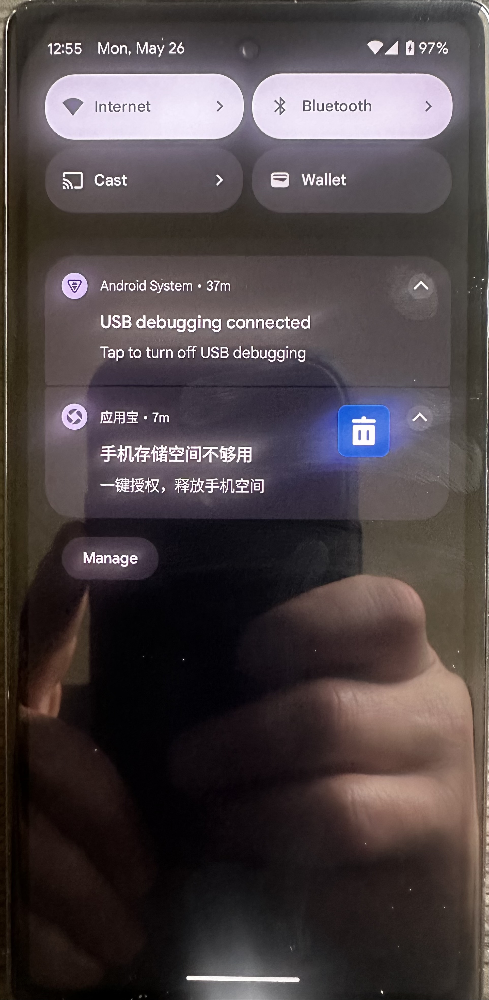
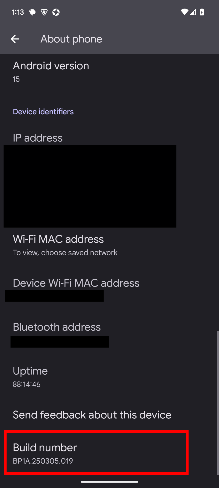
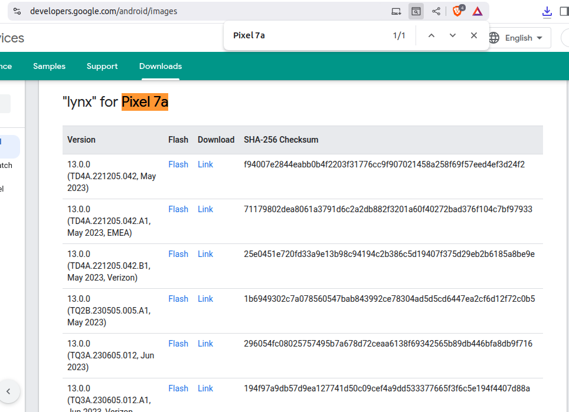
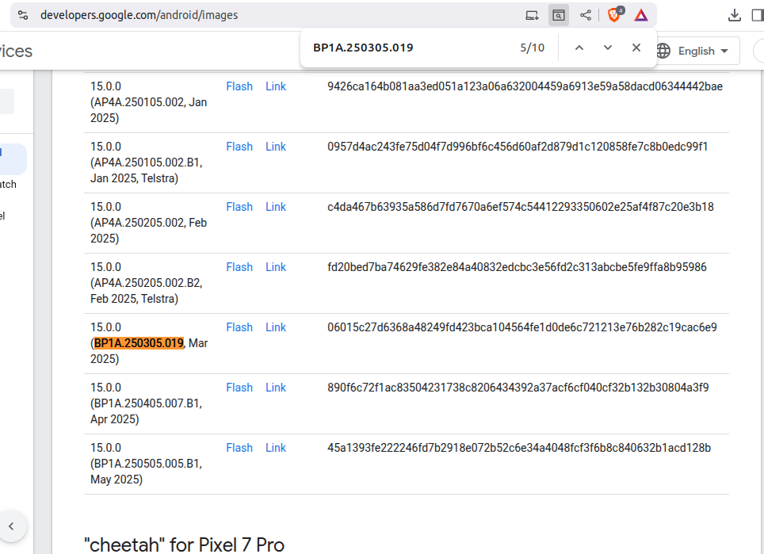
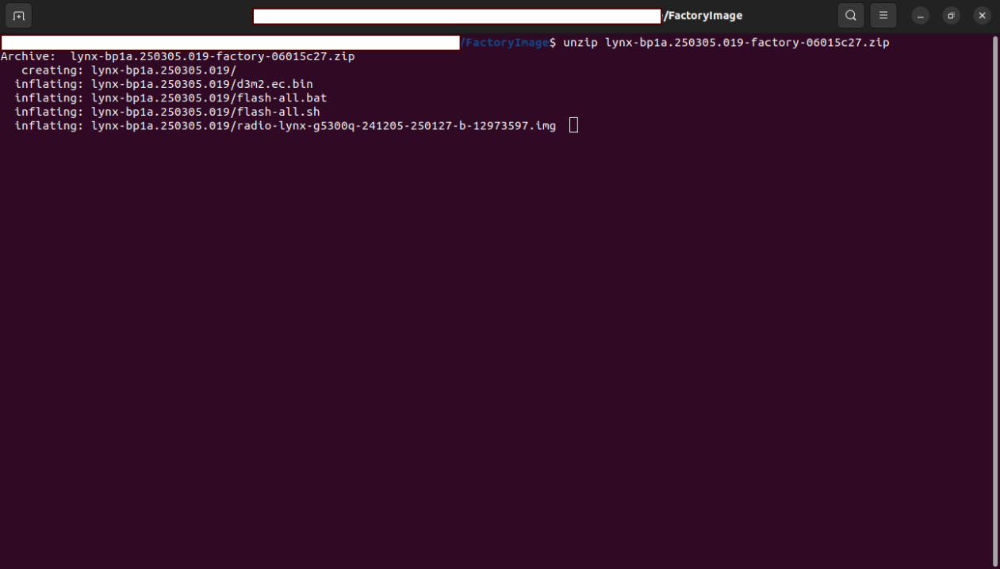

# Rooting Android

This post focuses on how to root an Android phone. I have done this a few times
now and forunately, the process gets easier each time.  I am rooting my phone
because I need to dump the routing rules and table for the [Linux Routing]()
post. The phone I'm rooting is an Google Pixel 7a. This is a bummer for apps
that use hardware-based attestation supported by Google's SafetyNet API because
they wont run on an unlocked/modified ROM.

The overview of what I will be doing is:

1. Unlock the bootloader
2. Extract the `init_boot` files
3. Patch `init_boot` 
4. Flash new `init_boot`

The hardware and software requirements are below.

## Hardware

* Pixel 7a
* Machine (Laptop) to attach to Pixel
* USB cable to link PC to Pixel



## Software

* Magisk
* adb

# Unlock the bootloader

The first thing you need to do is unlock the bootloader. This process 
will wipe your device storage, so backup anything you care about before
doing this.

1. Enable developer mode: Settings > About Phone > tap `Build Number` 7 times
2. Enable USB debugging and OEM Unlocking: Settings > System > Advanced > Developer Options
3. Link Pixel to PC
4. Unlock bootloader with adb

```bash
$ adb reboot bootloader 
$ fastboot flashing unlock # or fastboot oem unlock
```
Figure 1. Commands to run from machine 

5. Reboot: Press the power button
6. Enable USB debugging and OEM Unlocking: Settings > System > Advanced > Developer Options

# Extract the `init_boot` files

1. Get factory image for your device [link](https://developers.google.com/android/images).





2. Extract `init_boot` files from the extracted factory image.



```bash
$ 
```
3. Copy `init_boot` files to device:

```bash
$ adb push 
```

# Patch `init_boot` 

# Flash new `init_boot`
