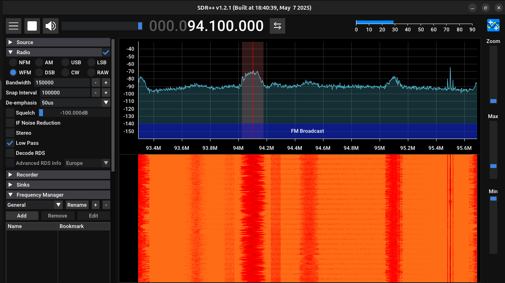

# SDR (Software Defined Radio) & Conspiracies For Newbies

I've been wanting to mess around with SDR for some time and 
haven't found (or made) the time for it until now. The really
low-level side of computing has always fascinated me. From when
I first derived Maxwells Equations in electromagnetism section
of my physics course work, to the crazy esoteric work of 
Thomas Townsend brown the the conspiracy-theory podcasts I'm
so fond of. Unforunately, I am still quite the amateur, so of course
I Googled, "SDR projects for beginners". I found a nifty article 
by [blinry](https://blinry.org/) titled [50 Things you can do with an SDR](https://blinry.org/50-things-with-sdr/).

I've never heard of the "Do 50 of something" challenge, which I think
is really cool, but before I think of my own 50 things to do, I'm
going to try a few of the things in his post, and then combine that
with my love for conspiracy theories, particularly those of the
"scalar-wave" stuff related to Thomas Townsend Brown's work (I think
that's his stuff at least). I don't know if anything will come of this
or the degree to which SDR and scalar-waves are related, but fuck it.

# Antenna 

## Capture Specific wavelengths

Orient the antenna vertically and make them half as long as the wavelength you are trying
to measure.

# Listen to FM Radio

The lowest hanging fruit I could think of, and apparently blinry agreed, was to
listen to FM radio. It turned out to be surprisingly easy. I simply went to the 
the 94.1 MHz (94 Rock in Abq), adjusted the length of the antenna, and voila, 
Red Hot Chile Peppers is playing from my computer!

